# ADR-0010: Private pilot browser access for bounded development

Status: Proposed — technical/security owner decision required
Date: 2026-10-02
Decision owners: Repository owner; platform/network/identity/operations reviewers

## Context

The owner keeps the application private and requests the easiest development access. The approved foundation is an internal East US 2 Container Apps environment and protected private services; the historical synthetic session was disposed. Mac/home browser reachability has no approved binding. The source collector remains outbound HTTPS and provides no human browser route. Actual customer role/home-origin proof, production composition, audit-outage preservation and refreshed paid session remain open.

## Decision drivers

- Keep application and data services private; preserve accepted ADR-0002/0004/0009 and identity policy.
- Start with one operator performing development tests, with no corporate/customer network connection and no new customer Azure infrastructure roles.
- Fit bounded paid sessions under the USD50 monthly allowance; avoid an always-on network gateway without an accepted budget.
- Keep exact configuration and templates versioned; actual identities/addresses/credentials remain in protected intake.

## Options considered

### A — One private Windows test desktop through Bastion Developer

Candidate Standard_B2s Windows VM and single-writer E10 LRS OS disk, in a dedicated nondelegated subnet of the same reviewed pilot VNet. VM has no public IP. Operator opens the Azure portal Bastion connection, then the private BFF HTTPS origin inside the VM's browser. Developer SKU uses a shared management service, supports one connection, no peering/native tunneling and no session recording. East US 2 is documented as supported. The Bastion management endpoint is internet reachable under Azure authorization; the application and VM RDP are not publicly exposed. This is a developer workstation boundary, not a network-wide VPN.

- Advantages: no Mac VPN client/profile or home-network route; SKU-specific docs support free Developer portal RDP; reuse pilot VNet DNS/NAT.
- Disadvantages: additional managed OS, user-controlled VM login and disk costs; one connection at a time. Initial proposal is owner-operated only, with each test session signed out before another persona.
- Risks: workstation access can become a lateral movement path. Restrict egress to the reviewed app HTTPS endpoint, necessary DNS/platform/authentication/update destinations and deny protected data endpoints; validate effective rules. VM access does not grant application access. Microsoft Entra RDP requires Basic or higher; Developer uses a separately reviewed protected local VM login. Separate setup administration from routine nonadministrator RDP use.

### B — Entra-authenticated point-to-site VPN

Supported Azure VPN Client on macOS with a compatible route-based OpenVPN gateway and exact user restrictions, client pool/routes/private DNS design. It permits the user's native browser to reach the private app and can support simultaneous named users.

- Advantages: native Mac browsing; viable future distributed user path.
- Disadvantages: gateway, DNS routing/support and operator burden. East US 2 public VpnGw1AZ rate USD0.21/hour = USD156.24 for October744hours before IP/DNS/transfer/foundation. Basic cannot provide Entra P2S authentication. Bounded sessions still require full priced approval.
- Risks: VPN authorization supplies network reachability independently of product tenancy; broad routes/permissions can expose other pilot services. Client pool cannot be invented or overlap home/pilot networks.

### C — Dedicated Bastion or public ingress

Dedicated paid Bastion adds richer features but needs its own exact reviewed boundary and price. Public application access was withdrawn by the owner. Neither option is selected by this proposal.

## Decision

**Recommended candidate: A for initial owner-operated development. Not accepted yet.** No subnet/CIDR, NSG source, VM credential, Azure grant or resource is authorized by the recommendation. The owner supplied private-hosting intent and an organizational external account request; the new operational workstation/access boundary still requires this concrete review under AGENTS.md. No production customer delivery or simultaneous customer testing claim follows.

## Proposed connection sequence

```mermaid
flowchart LR
    Mac["Operator Mac browser"] -->|"Azure portal authorization · HTTPS"| Bastion["Bastion Developer · shared service"]
    Bastion -->|"Reviewed local OS login · private RDP"| Desktop["Private Windows test desktop"]
    Desktop -->|"Private DNS · HTTPS · Entra app sign-in"| BFF["BFF on internal Container Apps"]
    BFF -->|"Reviewed workload identity and private connectivity"| Data["Protected data/key services"]
```

This is a proposed sequence, not deployed evidence. Desktop network rules must deny direct protected-service access; existing BFF deployment/provider/key/audit prerequisites are still absent.

## Rationale

A gives an understandable portal-to-desktop-to-private-app experience without an always-on VPN gateway. SKU-specific Microsoft documentation confirms Developer Windows RDP and East US 2 availability, but actual provider/authentication/NSG behavior must be proved. The generic RDP article still lists Basic as its minimum: do not treat that documentation mismatch as executed Developer evidence or automatically upgrade to a paid tier.

## Security, operations and cost impact

- Keep internal environment/publicNetworkAccess Disabled, private protected services and separate worker identities. A BFF app may use external:true within the internal environment solely for reviewed VNet HTTPS reachability; bootstrap external:false is insufficient. Inventory all environment-level routes; no public/worker route inferred.
- Allocate a distinct VM subnet in protected review. Restrict RDP to the verified Developer service source on only the target NIC; deny Internet/whole-VNet management rules and default lateral access. Exact source and effective routing are blocked inputs until supported/provider proof exists.
- Review owner OS account, password-based Developer portal method and protected credential creation/storage/rotation. No account is created or credential entered now; browser password creation/entry requires owner handoff. This OS credential is not an application-local emergency account or application authorization bypass. No customer receives that credential or Azure Reader roles.
- Existing NAT attaches only to the delegated Container Apps subnet. The desktop needs reviewed explicit outbound connectivity on its new subnet; default outbound cannot be assumed. Any NAT attachment provides connectivity, not destination filtering. Review NSG/Windows firewall or other supported destination enforcement, platform/identity/certificate/update traffic and denial of broker/control-plane/protected services. Do not silently add a paid firewall or broad Internet443 rule.
- Review egress/update/patching/OS-browser image provenance, required platform traffic, clipboard/local browser storage and disposal. Developer lacks recording and cannot disable clipboard; initially use synthetic data only. No customer evidence is approved on this workstation.
- Candidate Windows compute USD0.0496/hour (USD1.1904 per24 running hours); E10 LRS disk USD9.60/month plus USD0.002/10K operations. Stopping inside Windows is not deallocation; disk persists and bills until removed. An always-running October desktop alone would be USD46.5024 compute plus that disk, before operations/foundation. These partial rates are not a complete session quote. Foundation/extra private DNS/egress/operations, charge lag and cleanup reserve remain required. No new USD25/24hour approval is inferred.
- VM is disposed after preserved sanitized evidence; no new backup/retention/purge schedule. Preserve required gate/engineering evidence separately under the accepted lifecycle. User sign-in stays disabled until production provider/key/audit/trust proofs pass.

## Migration and reversibility

After exact design acceptance, add a separate optional VM/Bastion/browser-DNS template packet; do not rewrite or silently replay the disposed foundation. Preview full composed changes, verify private inputs and preserve ownership/cleanup inventory before paid approval. Rollback closes/disconnects the workstation, deallocates then removes only the reviewed VM/NIC/disk/NSG/subnet/browser-DNS/Bastion resources when their dependencies permit. Never delete the entire pilot group or unrelated data/keys. Cost-management budgets are alerts, not resource shutdown.

## Validation

[Implementation and test proposal](../../plans/active/private-pilot-browser-access-preparation.md) maps positive and negative tests to G1/G3/G7, IP-HAS-002/003, SEC-PILOT-001/002/008/009 and TP-HAS-009/014/020. No network/runtime test has executed in this proposal. Directory existence/licensing/CA and external home-account trust remain separate from access connectivity.

## References

- [Bastion SKU capabilities and regions](https://learn.microsoft.com/en-us/azure/bastion/bastion-sku-comparison)
- [Developer portal connection](https://learn.microsoft.com/en-us/azure/bastion/quickstart-host-portal)
- [Generic Windows RDP guidance and authentication caveat](https://learn.microsoft.com/en-us/azure/bastion/bastion-connect-vm-rdp-windows)
- [Entra RDP requires Basic or higher](https://learn.microsoft.com/en-us/azure/bastion/bastion-entra-id-authentication)
- [Explicit outbound connectivity](https://learn.microsoft.com/en-us/azure/virtual-network/ip-services/default-outbound-access)
- [Entra P2S gateway prerequisites](https://learn.microsoft.com/en-us/azure/vpn-gateway/point-to-site-entra-gateway)
- [Internal environment ingress](https://learn.microsoft.com/en-us/azure/container-apps/ingress-overview)
- [Internal environment DNS](https://learn.microsoft.com/en-us/azure/container-apps/private-endpoints-with-dns)
- [Sanitized price/preparation evidence](../../docs/development/evidence/private-browser-access-preparation-20261002.json)

## Approval

Accepted by: Pending
Date: Pending
Scope requested: bounded design/technical/test review only; templates follow acceptance. Exact Azure access actions, credentials, paid session, live sign-in, production release and G1 acceptance remain separate.
