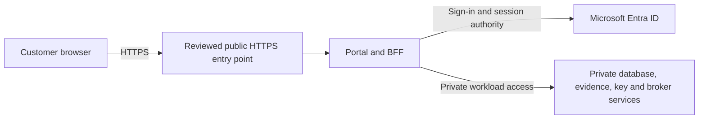

# Post-pilot HTTPS portal with login

Status: DEFERRED — planning requested; implementation and public exposure not approved
Owner: Repository owner and Azure/BFF coordinator
Date: 2026-10-02
Trigger: pilot completion accepted by the owner with required gate evidence

## Request and customer experience

On2026-10-02 the owner requested: “Move forward with bastion but plan Https portal with login after pilot is done.” During the pilot, [ADR-0010](../../architecture/decisions/ADR-0010-private-pilot-browser-access.md) authorizes an owner-operated synthetic development desktop. After the pilot, the intended customer experience is an ordinary browser opening a public HTTPS portal URL and completing organizational sign-in; customers should not need Bastion or a VM login. Bastion remains an operator development tool.

This plan records sequence and decisions to prepare. It does not implement new product behavior, expose current Azure resources, enable the disabled BFF host or change the approved identity policy.

## Architecture to review after the pilot

Candidate shape only: a narrowly exposed portal/BFF entry point with private data services. Select the ingress service, origin exposure controls, certificate/domain and proxy trust in a new reviewed ADR. Do not assume a public Container Apps environment, paid edge SKU, custom domain or network-wide access. Existing [ADR-0002](../../architecture/decisions/ADR-0002-pilot-tenant-isolation.md), [ADR-0004](../../architecture/decisions/ADR-0004-azure-pilot-technology-platform.md) and [ADR-0009](../../architecture/decisions/ADR-0009-production-bff-authority-and-audit.md) constrain tenancy, platform and BFF authority.

Use the approved [identity/session design](../../docs/security/health-assessment-identity-session-design.md) and [authorization matrix](../../docs/security/health-assessment-authorization-matrix.md) as the baseline: supported organizational Entra sign-in, reviewed B2B onboarding, MFA/Conditional Access, server-side sessions and server-side customer/project/role isolation. An invited identity must also receive the exact product assignment. Public reachability grants no data authority. Consumer/social accounts, open self-registration and new customer roles require separate policy/product decisions.

## Ordered work and exit criteria

| Step | Requested owner | Needed input / completion condition |
|---|---|---|
| PP01 — pilot exit | Pilot owner and gate reviewers | Attributed pilot completion; remaining gate/acceptance evidence resolved or explicitly handled under the approved process. No automatic start from a calendar date. |
| PP02 — scope and identity | Product/identity/security owners | Approved portal product and technical specs, customer onboarding/invitation and lifecycle, exact roles and supported organizations, MFA/CA, support and revocation behavior. Protected identity values remain outside Git. |
| PP03 — public boundary ADR | Platform/security/operations owners | Review public ingress and private origin/data boundaries, exact proxy/header contract, DNS/domain ownership and certificate lifecycle, abuse/rate controls, outage behavior and complete pricing/operational model. No SKU chosen by this plan. |
| PP04 — implementation packet | Engineering coordinator | Approved ADR, implementation and test plan; deployable production BFF/provider/key/audit composition, reviewed images, server-side authorization; versioned IaC in `infra/` and deliberately incomplete protected input template. |
| PP05 — staged evidence | Independent reviewers | Browser/TLS/login/logout/CSRF/proxy spoofing, unauthorized/expired/revoked/wrong-customer denials, direct-origin/data isolation, accessibility, recovery and audit-outage evidence on the exact version. |
| PP06 — release | Repository owner and release/security/operations owners | Explicit production/public release approval, priced environment/session, operational ownership and rollback rehearsal, safe deployment and independent live verification. |

## Required tests and operational review

Map the new approved packet to feature003 tests and security controls before coding. Verify anonymous access cannot reach protected data; MFA and external organizational admission; tenant/project isolation and field filtering; secure cookies/CSRF; exact TLS/canonical host/redirect URI; trusted proxy and header spoofing denials; direct-origin bypass; private database/key/blob/broker reachability; abuse controls; sign-out/revocation; audit failures and unknown commits; availability/recovery; manual accessibility. No planned test is a passing test.

Price the complete public architecture against the expected usage and new budget decision. The existing USD50 development allowance and disposed historical session do not authorize an always-on customer service. Define monitoring, incident/support ownership, certificate/key/image updates, backups/restores, evidence retention and rollback from approved policies, not invented defaults.

## Current state

Planning intent recorded; PP01–PP06 not executed. Pilot remains private. No public ingress, invitation, grant, password, domain purchase or resource deployment occurred. Customer identity proof/detailed role, production BFF/key/audit composition and exact private development access remain dependencies in the [current access plan](private-pilot-browser-access-preparation.md). The private status board is stale for this change because its publishing credential/network action was rejected by automatic approval review; approval of that specific action is still pending.
